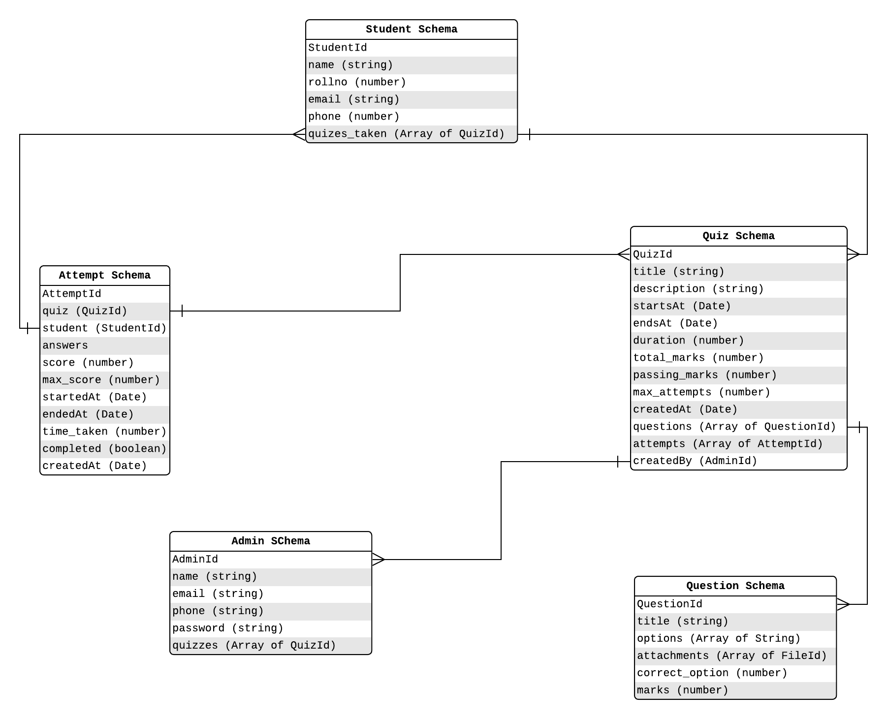
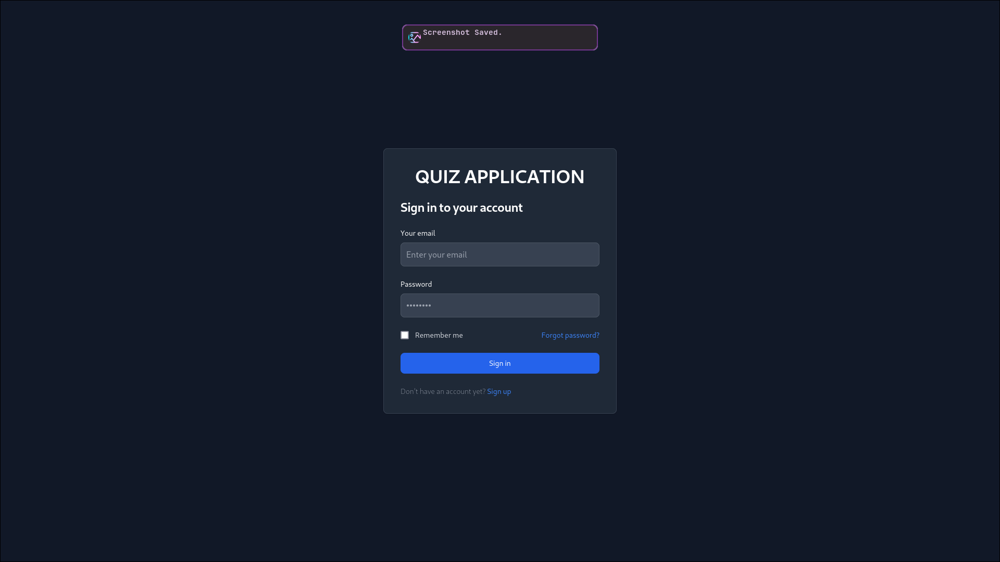
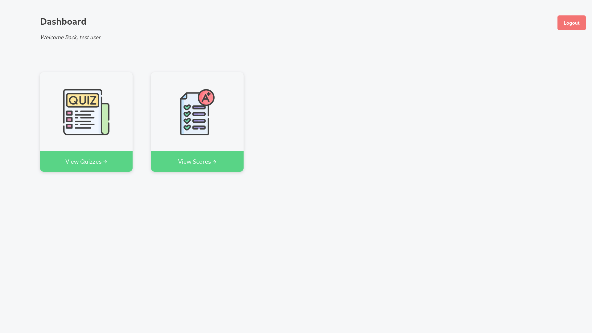
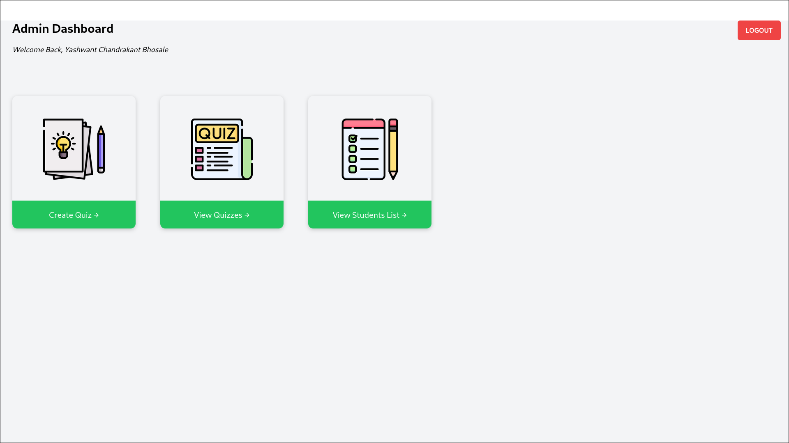
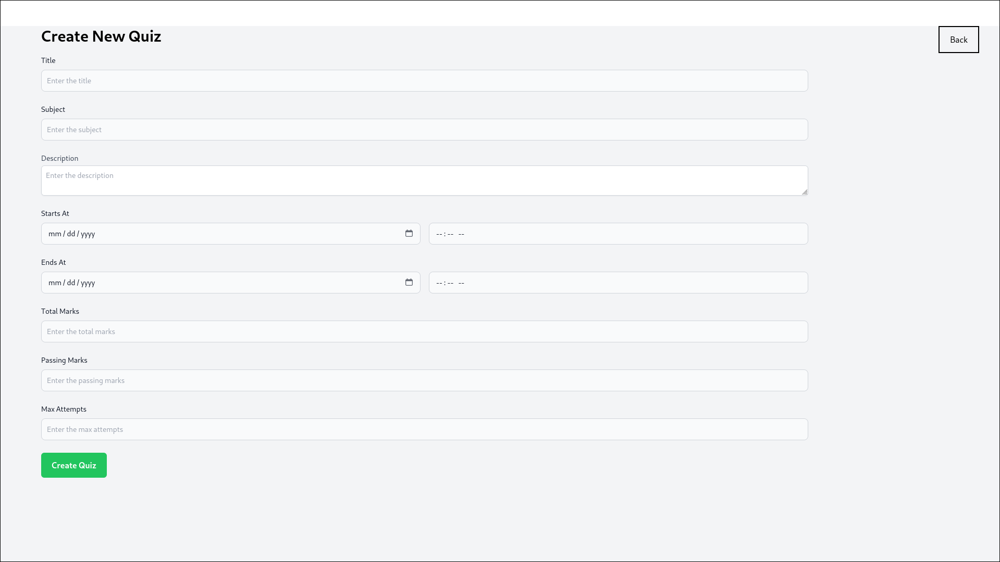
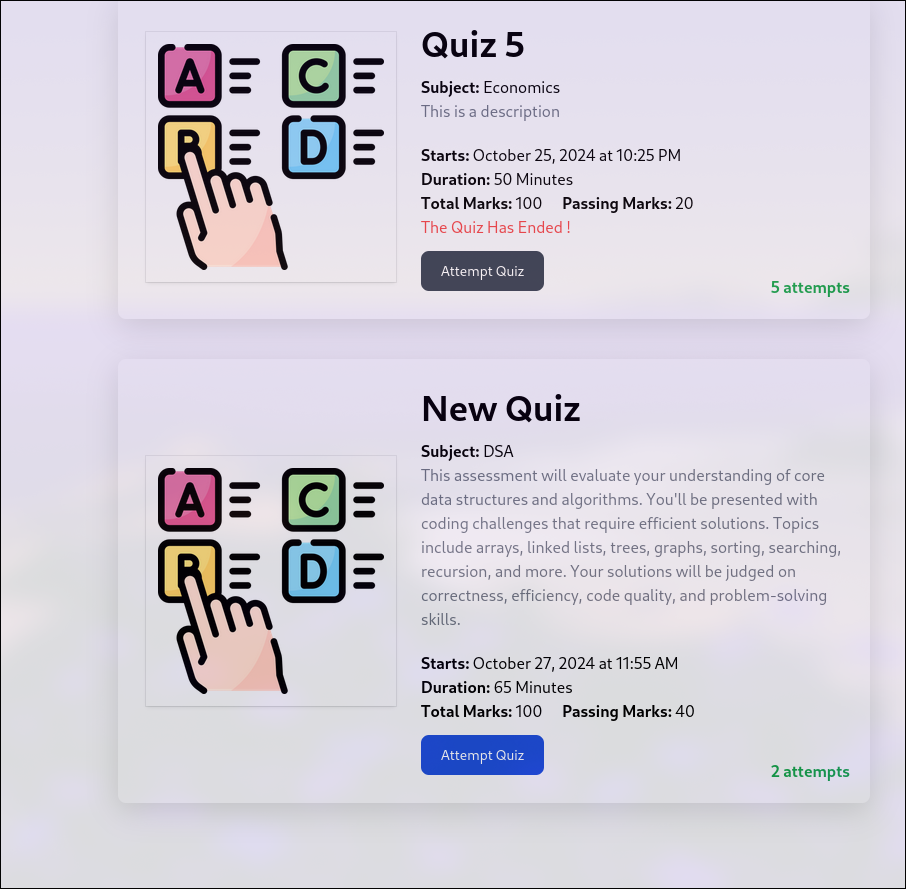
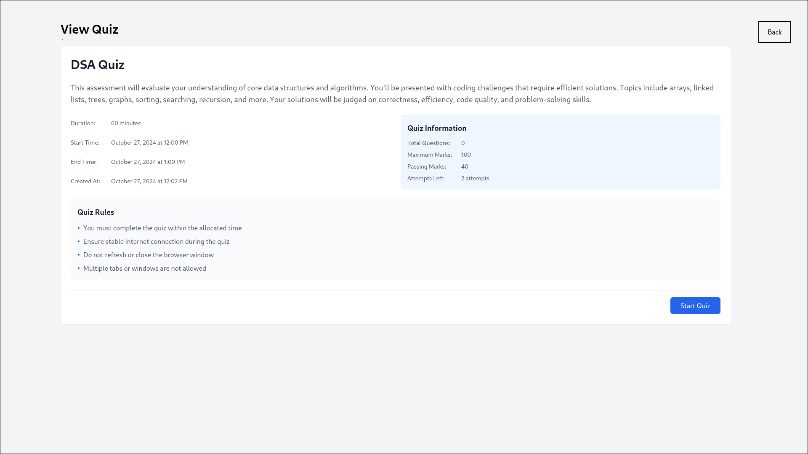
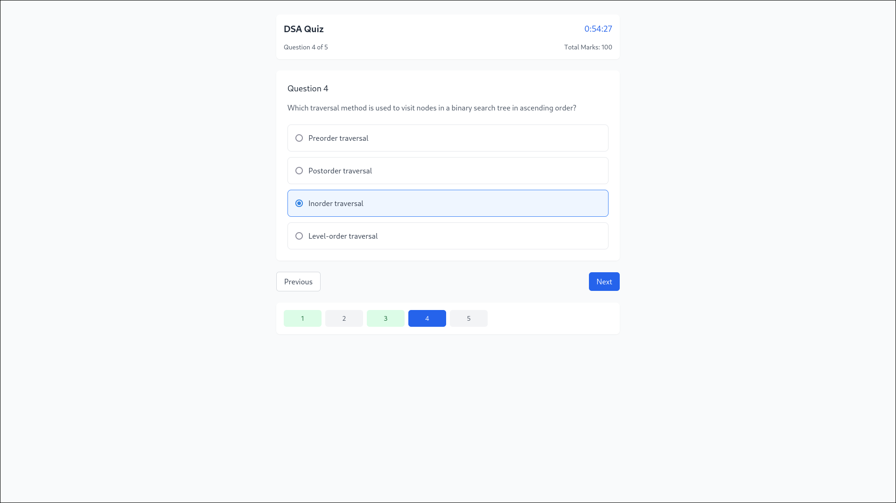

# Quiz Application

An interactive and fun quiz application where users can test their knowledge on various topics. This application provides multiple quiz categories, tracks scores, and offers instant feedback on answers.

## Table of Contents

1. [Features](#features)
2. [Database Design](#database-design)
3. [Screenshots](#screenshots)
4. [Getting Started](#getting-started)

---

## Features

- **Authentication**: Secure OTP validation and JWT-based authorization to protect user accounts and maintain session security.
- **Scoring**: Tracks score after each quiz, providing a summary of user performance.
- **Timer**: Adds a timer to create a sense of urgency for each quiz.
- **Admin Portal**: Allows for the creation of admin accounts, enabling admins to create new quizzes with specified start and end times.

## Database Design


## Screenshots








## Getting Started

1. **Clone the repository**:
    ```bash
    git clone https://github.com/YashwantBhosale/quiz-app.git
    ```
2. **Navigate to the project directory**:
    ```bash
    cd quiz-app
    ```
3. **Install server dependencies**:
    ```bash
    cd server
    npm install
    ```
4. **Install client dependencies**:
    ```
    cd client
    npm install
    ```
5. **Start the application**:
    Server:
    ```bash
    cd ../server
    nodemon server.js
    ```
    Client:
    ```
    cd ../client
    npm run dev
    ```
6. Open the application in your browser:
    ```plaintext
    http://localhost:5173
    ```
